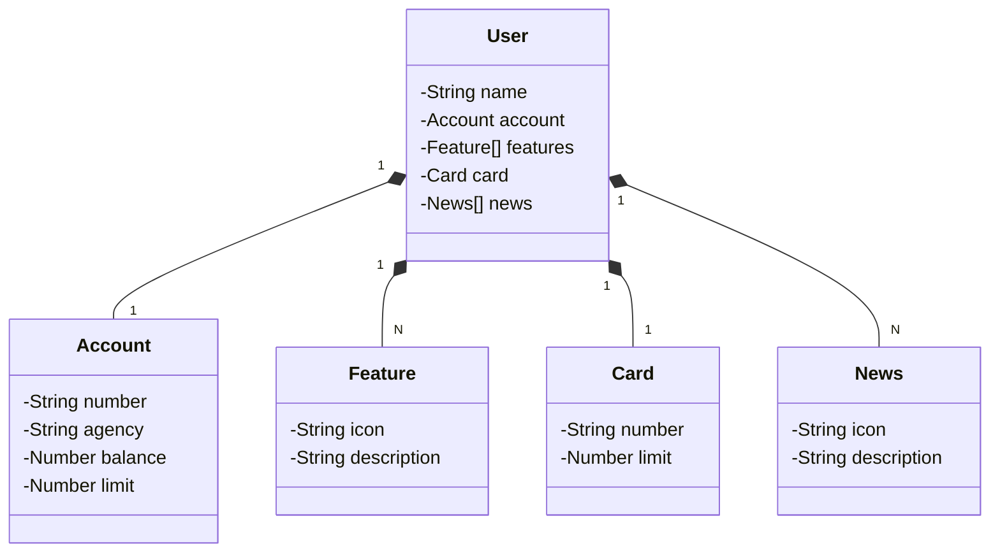

# Santander DEV Week 2023

## Descrição
Java RESTful API criada para o evento Santander DEV Week 2023.

## Ferramentas utilizadas
- **Java 17**
- **Docker Engine**
- **Gradle**
- **PostgreSQL**
- **Spring Framework**

## Compilação e execução
Com o [Docker](https://www.docker.com/products/docker-desktop/) instalado e aberto, siga os seguintes passos:
1. Clone este repositório e acesse a pasta raíz do projeto
```bash
git clone git@github.com:joaquimchianca/santander-dev-week-2023.git
cd santander-dev-week-2023
```
2. Gere o arquivo executável `.jar` por meio do Gradle e suba os containers
```bash
./gradlew build -x test
docker compose up
```
Feito isso, a aplicação deve funcionar sem problemas no servidor local na URL `localhost:8080`.

Qualquer problema com execução desse código, pode entrar em contato comigo através do
<a href="mailto:joaquimchianca@gmail.com">e-mail</a> (joaquimchianca@gmail.com).

## Documentação da API
Com o servidor executando localmente, acesse

### `localhost:8080/swagger-ui/index.html`

## Diagrama UML
